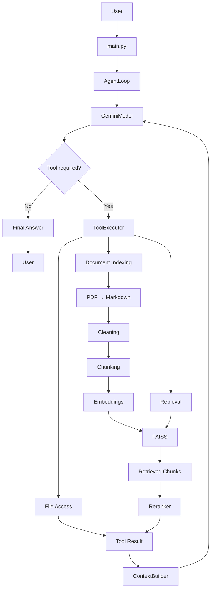

# Argon

> A tool-using CLI AI agent that combines Gemini, local document retrieval, FAISS vector search, reranking, and filesystem tools.

Argon is a modular AI agent designed to work with user-provided documents and local files. Instead of simply sending every question directly to an LLM, Argon allows the model to decide when it needs external tools, executes those tools locally, feeds their results back into the model, and then generates the final response.

The project was built to explore how an AI agent actually works internally — from model interaction and tool calling to RAG, vector retrieval, reranking, context construction, and persistent document indexing.

---

## ✨ What Argon Can Do

* 💬 Answer general questions using Gemini
* 📄 Understand and index PDF documents
* 🔎 Retrieve relevant information using semantic search
* 🧠 Use vector embeddings and FAISS for local retrieval
* 🎯 Rerank retrieved candidates for improved relevance
* 🛠️ Dynamically call tools when required
* 📁 Read, write, append, list, and delete local files
* 🔄 Feed tool results back into Gemini for further reasoning
* 🖥️ Run entirely as a local CLI application

---

# 🏗️ Architecture

Argon follows a model → tool → observation → model workflow.



### Core components

| Component                   | Responsibility                                                                    |
| --------------------------- | --------------------------------------------------------------------------------- |
| `main.py`                   | CLI entry point                                                                   |
| `AgentLoop`                 | Controls the model → tool → result → model flow                                   |
| `GeminiModel`               | Communicates with Google's Gemini API                                             |
| `ToolExecutor`              | Maps model-generated tool calls to actual Python functions                        |
| `ContextBuilder`            | Combines conversation state and tool results into context for the next model call |
| `index_document.py`         | Handles document ingestion and indexing                                           |
| `retrieve.py`               | Performs semantic retrieval                                                       |
| `vector_store.py`           | Manages the FAISS vector store                                                    |
| `chunking.py`               | Splits documents into retrieval-friendly chunks                                   |
| `embeddings.py`             | Generates vector representations                                                  |
| `file_access.py`            | Provides filesystem operations                                                    |
| `document_understanding.py` | Extracts/understands document content                                             |

---

# 🧠 How the Agent Loop Works

The core of Argon is the `AgentLoop`.

A normal LLM application looks like:

```text
User
 ↓
LLM
 ↓
Answer
```

Argon instead uses an iterative tool-using workflow:

```text
User Question
      ↓
    Gemini
      ↓
Does Gemini need a tool?
   ↙           ↘
 No             Yes
 ↓               ↓
Answer      ToolExecutor
                 ↓
             Tool Result
                 ↓
           ContextBuilder
                 ↓
               Gemini
                 ↓
              Answer
```

For example, if the user asks:

```text
What is my CGPA?
```

Gemini may determine that it needs information from an indexed document.

It can request:

```text
retrieve("my CGPA")
```

Argon's `ToolExecutor` executes the retrieval tool.

The retrieved information is then passed through `ContextBuilder` and returned to Gemini.

Gemini can then use that information to generate the final response.

### The responsibilities are intentionally separated

**AgentLoop**

> Decides what happens next.

**ToolExecutor**

> Actually executes the requested tool.

**ContextBuilder**

> Packages the result so the model can use it in the next turn.

This separation keeps the agent logic independent from individual tools.

---

# 🔎 Retrieval-Augmented Generation

Argon's document pipeline follows:

```text
PDF
 ↓
Document Understanding
 ↓
Markdown
 ↓
Cleaning
 ↓
Chunking
 ↓
Embeddings
 ↓
FAISS
 ↓
Similarity Search
 ↓
Reranking
 ↓
ContextBuilder
 ↓
Gemini
 ↓
Final Answer
```

## 1. Document ingestion

A PDF is first processed into a structured representation.

```text
PDF
 ↓
Document Understanding
 ↓
Markdown
```

This makes the document easier to clean and divide into meaningful sections.

## 2. Cleaning

Extracted content is cleaned before retrieval.

The goal is to remove unnecessary noise while preserving useful document structure.

## 3. Chunking

Large documents are divided into smaller chunks.

Instead of embedding an entire 100-page PDF as one vector:

```text
100-page PDF
      ↓
    chunks
 ┌────┼────┬────┐
 ↓    ↓    ↓    ↓
 C1   C2   C3   ...
```

Each chunk can then be independently retrieved.

## 4. Embeddings

Each chunk is converted into a numerical vector representing its semantic meaning.

```text
"Ravi's CGPA is 6.45"
          ↓
     Embedding Model
          ↓
 [0.12, -0.43, 0.71, ...]
```

## 5. FAISS retrieval

When the user asks a question, the query is also converted into an embedding.

FAISS then searches for vectors that are semantically close to the query.

```text
User Query
    ↓
Query Embedding
    ↓
FAISS
    ↓
Top-K Candidate Chunks
```

---

# 🎯 Retrieval + Reranking

Semantic retrieval is fast, but the highest-similarity result isn't always the best answer.

During evaluation, Argon exposed a real retrieval failure where a **References** chunk could rank above the chunk containing the actual author/byline information.

The retrieval pipeline was therefore extended with a reranking stage:

```text
Query
  ↓
Bi-encoder / Embedding Retrieval
  ↓
FAISS
  ↓
Top-K Candidates
  ↓
Cross-Encoder Reranker
  ↓
Re-ranked Candidates
```

The idea is:

### Retriever

> Quickly find a broad set of potentially relevant documents.

### Reranker

> Carefully judge how relevant each candidate is to the specific query.

The reranking experiment fixed the specific byline retrieval failure, while also revealing a small regression on two near-duplicate-topic queries.

That result was kept as part of the evaluation rather than treating reranking as universally better.

This helped expose an important property of retrieval systems:

> Improving one retrieval failure mode can introduce trade-offs elsewhere, so retrieval changes should be evaluated rather than assumed to be improvements.

---

# 🧪 Retrieval Evaluation

Argon was tested using concrete retrieval queries rather than relying only on subjective inspection.

The evaluation process was:

```text
Query
 ↓
Baseline Retrieval
 ↓
Record Retrieved Chunks
 ↓
Identify Failure Cases
 ↓
Apply Retrieval Improvement
 ↓
Run Same Evaluation
 ↓
Compare Results
```

One of the observed failures was:

```text
Query
"What is the author/byline?"

Baseline:
References chunk     ❌
Author chunk          ↓
```

After reranking:

```text
Query
"What is the author/byline?"

Reranked:
Author chunk          ✅
References chunk      ↓
```

The evaluation also showed that the reranker slightly hurt two queries involving highly similar candidate topics.

This is an intentional part of the project: **measure retrieval behavior instead of assuming that a more complicated pipeline is automatically better.**

---

# 🛠️ Tool System

Argon uses a tool registry so Gemini can request specific capabilities without directly executing arbitrary Python code.

Conceptually:

```text
Gemini
   ↓
Tool Call
   ↓
ToolExecutor
   ↓
Registered Tool
   ↓
Result
   ↓
Gemini
```

Available tool categories include:

### 📄 Document tools

Used for understanding and indexing documents.

### 🔎 Retrieval tools

Used to search indexed documents using semantic similarity.

### 📁 File tools

Argon can perform filesystem operations such as:

* Read files
* Write files
* Append to files
* List files
* Delete files

The model does not directly execute filesystem operations. Instead, it requests a registered tool and the application executes it through `ToolExecutor`.

---

# 💾 Vector Store and Document Indexing

Argon maintains a local FAISS-based vector store for document retrieval.

The intended indexing flow is:

```text
Document
   ↓
Extract
   ↓
Clean
   ↓
Chunk
   ↓
Embed
   ↓
Add vectors
   ↓
Persist vector store
```

A key engineering issue encountered during development was the distinction between **creating a vector store** and **incrementally updating an existing one**.

Creating a new FAISS store for every document can overwrite previously indexed information.

The desired behavior is:

```text
Document A
    ↓
FAISS
    ↓
[A]

Document B
    ↓
Existing FAISS
    ↓
[A + B]
```

rather than:

```text
Document A
    ↓
FAISS
    ↓
[A]

Document B
    ↓
New FAISS
    ↓
[B]  ← A is lost
```

This became an important part of making Argon's indexing pipeline reliable.

---

# 🧩 Project Structure

```text
Argon/
│
├── agent/
│   ├── loop.py
│   ├── executor.py
│   └── context_builder.py
│
├── models/
│   └── gemini.py
│
├── retrieval/
│   ├── chunking.py
│   ├── cleaner.py
│   ├── embeddings.py
│   ├── index_document.py
│   ├── retrieve.py
│   └── vector_store.py
│
├── tools/
│   ├── document_understanding.py
│   └── file_access.py
│
├── data/
│
├── config.py
├── main.py
├── requirements.txt
└── README.md
```

The project is deliberately divided into separate layers so that model interaction, agent orchestration, retrieval, and tool execution are not tightly coupled.

---

# 🚀 Getting Started

## Prerequisites

* Python 3.10+
* A Google Gemini API key
* Git

## Clone the repository

```bash
git clone https://github.com/Ravisidh36/Argon.git
cd Argon
```

## Create a virtual environment

### Windows

```bash
python -m venv .venv
.venv\Scripts\activate
```

### Linux / macOS

```bash
python3 -m venv .venv
source .venv/bin/activate
```

## Install dependencies

```bash
pip install -r requirements.txt
```

## Configure the Gemini API key

Create a `.env` file in the project root:

```env
GEMINI_API_KEY=your_api_key_here
```

**Never commit your `.env` file or API key to GitHub.**

---

# ▶️ Running Argon

Start the CLI:

```bash
python main.py
```

You can then interact with Argon through the terminal.

Example:

```text
You > What is the capital of France?

Argon > Paris.
```

For document-based questions, first index the relevant document and then ask questions about its contents.

Example workflow:

```text
You > Index resume.pdf

Argon > Indexed document successfully.

You > What projects are mentioned in my resume?

Argon > ...
```

---

# ⚙️ Design Decisions

## Why a separate AgentLoop?

The AgentLoop owns orchestration instead of putting tool execution directly inside the model wrapper.

This makes it possible to change:

* the model
* the available tools
* the retrieval system
* the context construction strategy

without rewriting the entire application.

## Why FAISS?

FAISS provides efficient vector similarity search and works well for a local document-oriented RAG system.

## Why reranking?

Embedding similarity is useful for retrieving candidates quickly, but semantic similarity does not always mean that a chunk directly answers the user's question.

Reranking provides a second relevance stage.

## Why local retrieval?

Argon is designed around user-provided documents, so keeping retrieval and document processing local avoids requiring a central server-side document store.

---

# 🔐 Security Considerations

Argon can interact with the local filesystem, so tool execution needs to be treated as a security boundary.

In a future hosted version, filesystem access should be sandboxed and scoped to the current user's allowed directories.

API keys should always be supplied through environment variables and never hard-coded into the source code.

---

# 🛣️ Future Improvements

Possible future improvements include:

* Persistent document metadata
* SHA-256 based document deduplication
* Better document version management
* More comprehensive retrieval evaluation
* Support for multiple sequential tool calls
* Improved conversation memory
* Streaming model responses
* More robust filesystem sandboxing
* Packaging Argon as an installable Python CLI
* Additional model/provider adapters

These are intentionally kept separate from the core architecture so Argon can evolve without making the agent unnecessarily complex.

---

# 🧠 What I Learned

Building Argon involved more than connecting an LLM to a vector database.

The project helped explore:

* LLM tool calling
* Agent orchestration
* RAG architecture
* Embeddings
* Vector similarity search
* FAISS
* Bi-encoder retrieval
* Cross-encoder reranking
* Retrieval evaluation
* Document chunking
* Context construction
* Filesystem tool execution
* Persistent vector stores
* Debugging real retrieval failures
* Designing modular AI systems

A major lesson from the project was that **retrieval quality cannot simply be assumed from the model or vector database**. It needs to be evaluated with real queries, failure cases, and measurable results.

---

# 📌 Project Status

Argon is an actively developed personal AI-agent project.

The core agent loop, tool execution, document retrieval, vector storage, and Gemini integration are implemented, with ongoing improvements focused on retrieval quality, persistence, evaluation, and usability.

---

## Author

**Ravi Sidh**

GitHub: [@Ravisidh36](https://github.com/Ravisidh36)
